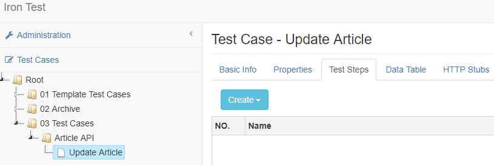
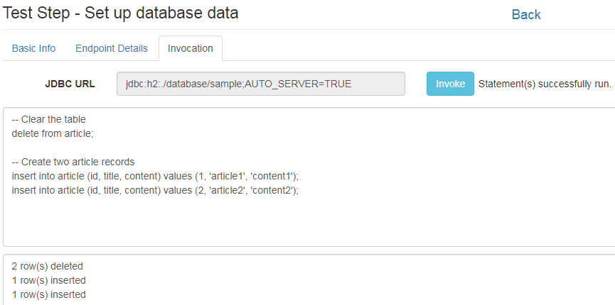
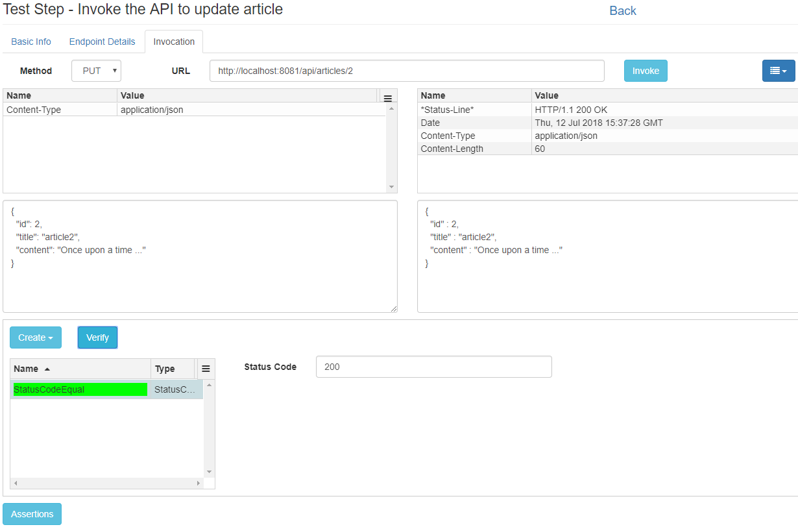
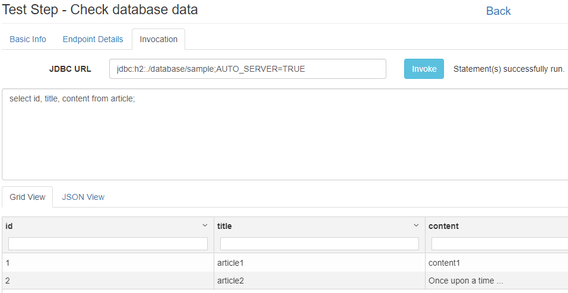
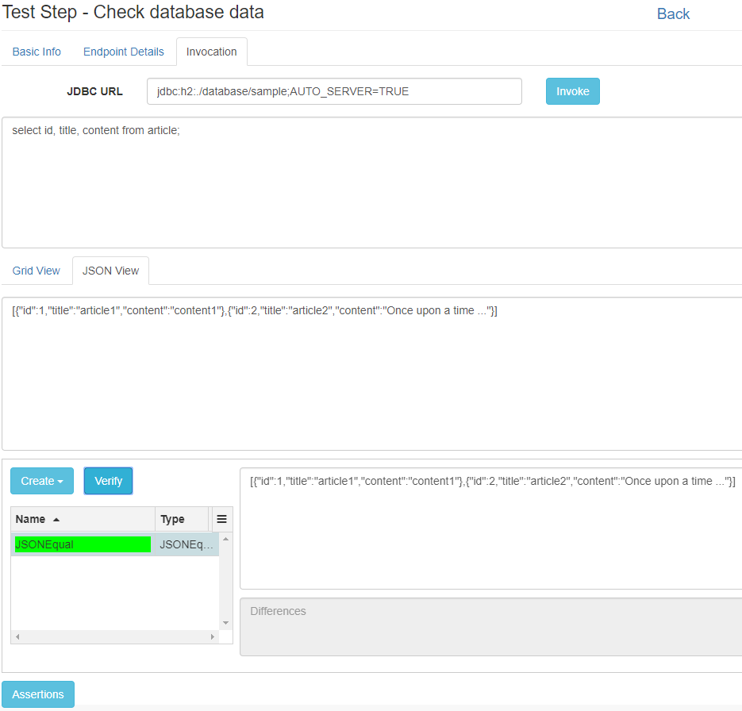
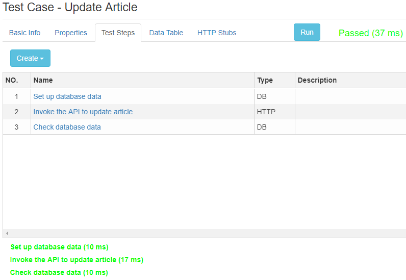
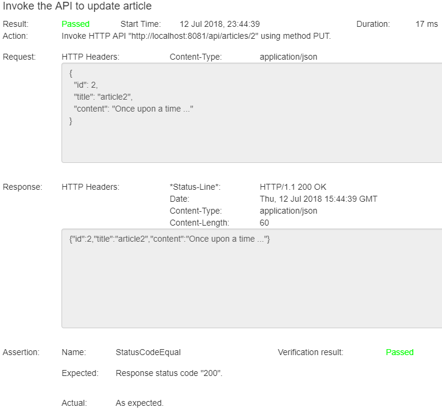

# Iron Test
Iron Test is an open source tool for integration testing APIs such as HTTP APIs (including RESTful APIs), SOAP web services, relational databases, JMS APIs (TBD), WebSphere MQ, IBM Integration Bus (IIB), etc. It is suitable for Integration, ESB, Microservices and SOA testing.

The tool 
* has GUI, saving user programming skills.
* provides advanced features like unlimited level folder structure for test case management, centralized and environment based endpoints management, user defined properties, data driven testing, mock service (TBD), full-text test case searching (TBD), and built-in (no VCS) team collaboration (partially done).
* intends to provide a platform enabling integrating testing capabilities for all types of APIs (potentially including mainframe and IOT) so that user does not have to pick up a new set of tools for testing a new type of API.
* is designed for testers and developers, but in the same team/organization BAs or architects may also benefit from it. The thought here is that API test cases contain valuable business knowledge, and this knowledge should be shared and easily accessible to everyone in the team/organization.
* does not support performance testing (for now).

Table of Contents:

- [Build](#build)
- [Deploy](#deploy)
- [Launch](#launch)
- [Use](#use)
    - [Integrated JSON HTTP API Testing](#integrated-json-http-api-testing)
        - [Create Test Case Outline](#create-test-case-outline)
        - [Populate Step 1](#populate-step-1)
        - [Populate Step 2](#populate-step-2)
        - [Populate Step 3](#populate-step-3)
        - [Run the Test Case](#run-the-test-case)
    - [More Usages and Testing Practices](#more-usages-and-testing-practices)
- [Maintain](#maintain)
- [License](#license)
        
## Build
Prerequisites: JDK (Java SE Development Kit) 8+, Apache Maven 3.3+.

Download the latest Iron Test release from [here](https://github.com/zheng-wang/irontest/releases) to your local machine. Extract it, cd to the project directory (in which there is README.md), and run below Maven command

`mvn clean package -P prod`

An `irontest-assembly/dist` folder is created containing the files and folders for deployment.

Notice that if this is the first time you build Iron Test, it could take 10 minutes (depending on your network speed) for Maven to download all the dependencies. From the second time, you should see the build time decreased to around 30 seconds, as the dependencies are already in your Maven local repository.
  
## Deploy
Create a folder on any computer/VM that has access to the APIs you want to test. This folder will be referred to as `<IronTest_Home>` hereafter.

Copy all files and folders from `dist` to `<IronTest_Home>`.

The build itself can interact with HTTP APIs, SOAP web services and open source databases (like H2). To enable interacting with other types of APIs or systems such as Oracle database or WebSphere MQ, refer to this [wiki page](https://github.com/zheng-wang/irontest/wiki/Interact-with-Other-Systems).

## Launch
Prerequisites: JRE (Java SE Runtime Environment) or JDK 8+.

To launch Iron Test application, cd to `<IronTest_Home>` and run below command

`java -jar <jarFilename> server config.yml`

On Windows, alternatively you can simply run `<IronTest_Home>\start.bat`. You might want to create a shortcut of it on your Windows Desktop, Task Bar or Start Menu for more convenient launching.

To verify the application is successfully launched, open a web browser, and go to Iron Test home page http://localhost:8081/ui (no ending '/'). 

Though the UI is crossing browsers, Google Chrome is preferred as it is the main browser that is used to test the application.

## Use
Open Iron Test home page (http://localhost:8081/ui). 

### Integrated JSON HTTP API Testing
We are going to demo how to test a JSON HTTP API that updates an article in database. 

The API is the sample Article API that is bundled with Iron Test. It does CRUD operations against the Article table in a sample H2 database. The sample database is automatically created under `<IronTest_Home>/database` when Iron Test is launched for the first time.
 
We are planning to have three test steps in our test case 
```
1. Set up database data
2. Invoke the API to update article
3. Check database data
```

#### Create Test Case Outline
First of all, create the (empty) test case by right clicking on a folder in the tree and selecting Create Test Case. Give it a name. The test case edit view shows as below.



You can create your preferred folder structure for managing test cases, by right clicking on folder and selecting needed context menu item.

Now we can add test steps to the test case.

Under the Test Steps tab, click Create dropdown button and select Database Step. Enter the name of step 1 `Set up database data`. Click Back link to return to the test case edit view. Repeat this to add the other two test steps (one HTTP Step and one Database Step). The test case outline is created as shown below.


#### Populate Step 1 
Click the name of step 1 to open its edit view.
          
Under the Endpoint Details tab, enter JDBC URL `jdbc:h2:./database/sample;AUTO_SERVER=TRUE` which will be used by the test step to connect to the sample database. Here `./database/sample` in the URL equals to `<IronTest_Home>/database/sample`, as Iron Test application is launched from directory `<IronTest_Home>`. Then enter Username and Password which can be found in `<IronTest_Home>/config.yml`.

Under the Invocation tab, enter below SQL script.
```
-- Clear the table
delete from article;

-- Create two article records
insert into article (id, title, content) values (1, 'article1', 'content1');
insert into article (id, title, content) values (2, 'article2', 'content2');
```

Click the Invoke button to try it out (run the script), like shown below.



Click the Back link to return to test case edit view.

#### Populate Step 2 
Click the name of step 2 to open its edit view.

Under the Endpoint Details tab, enter URL `http://localhost:8081/api/articles/2`. Ignore Username and Password fields as they are not used in this demo.

Under the Invocation tab, select `PUT` from the Method dropdown list, click the menu dropdown button and select `Show HTTP Headers`.

In the grid above the Request Body text area, add a request HTTP header `Content-Type: application/json` using the Create item in the grid menu (located in the top right corner of the grid). We need this header in the request because the Article API requires it. If it is not provided, the invocation will see error response. 
     
Input the request body for updating article 2.

```
{
  "id": 2,
  "title": "article2",
  "content": "Once upon a time ..."
}
```

Click the Invoke button to try it out and you'll see a successful response in the right pane. 

Click the Assertions button to open the assertions pane. In the assertions pane, click Create dropdown button and select `StatusCodeEqual Assertion` to create a StatusCodeEqual assertion. Enter the expected HTTP response status code (here 200), and click the Verify button to verify the assertion, as shown below.



More information about assertions can be found on this [wiki page](https://github.com/zheng-wang/irontest/wiki/Assertions).

Click the Back link to return to the test case edit view.

#### Populate Step 3  
Click the name of step 3 to open its edit view. 
 
Under the Endpoint Details tab, enter exactly the same information as in step 1 because we are interacting with the same database. The information duplication can be avoided by using `managed endpoints`. Refer to this [wiki page](https://github.com/zheng-wang/irontest/wiki/Endpoints-Management) for more details.

Under the Invocation tab, enter SQL query `select id, title, content from article;`.

Click the Invoke button to try it out (run the query), like shown below.



Click the JSON View tab to see the JSON representation of the SQL query result set.

Click the Assertions button to open the assertions pane. In the assertions pane, click Create dropdown button and select `JSONEqual Assertion` to create a JSONEqual assertion. Copy the JSON string from the JSON View to the Expected JSON field. Click the Verify button to verify the assertion, as shown below. 



Click the Back link to return to the test case edit view.

#### Run the Test Case
Now we have finished editing our test case. It's time to run it. Click the Run button, and you'll see the result for the whole test case beside the Run button, and in the bottom pane an outline of result for all test steps, like shown below. Passed test step is indicated by green color and failed test step by red color.



Click the link for a test step in the bottom pane to open a modal and see the step run report, like shown below.



Click the result link beside the Run button to see the whole test case run report. This report can be saved as HTML file and used as test evidence in other places such as HP ALM.

### More Usages and Testing Practices
Refer to the [wiki pages](https://github.com/zheng-wang/irontest/wiki).

## Maintain
The first time you launch the application, two new folders are created automatically under `<IronTest_Home>`.

    database - where system database and a sample database are located. Both are H2 databases. 
        System database is used to store all test cases, environments, endpoints, etc. you create using Iron Test.
        Sample database is for you to play with Iron Test basic features such as JSON HTTP API testing or database testing. An Article table is in it.
    
    logs - where Iron Test application runtime logs are located.
    
**It is highly recommended that you back up `<IronTest_Home>/database` folder regularly.** Remember to shut down the application before backing up.

To shut down the application
    
    On Windows: Ctrl + C
    
    On Linux/Unix: kill -SIGINT <pid>
    
You can tune Iron Test application to suit your runtime needs by changing contents of the config.yml under `<IronTest_Home>`. Refer to [Dropwizard doc](https://www.dropwizard.io/1.3.4/docs/manual/configuration.html) for how to do it. Re-launch the application for the changes to take effect.
    
To move Iron Test to a different folder or computer/VM, just shut down the application, copy the whole `<IronTest_Home>` folder over, and launch the application from there.

## License
Apache License 2.0, see [LICENSE](LICENSE).